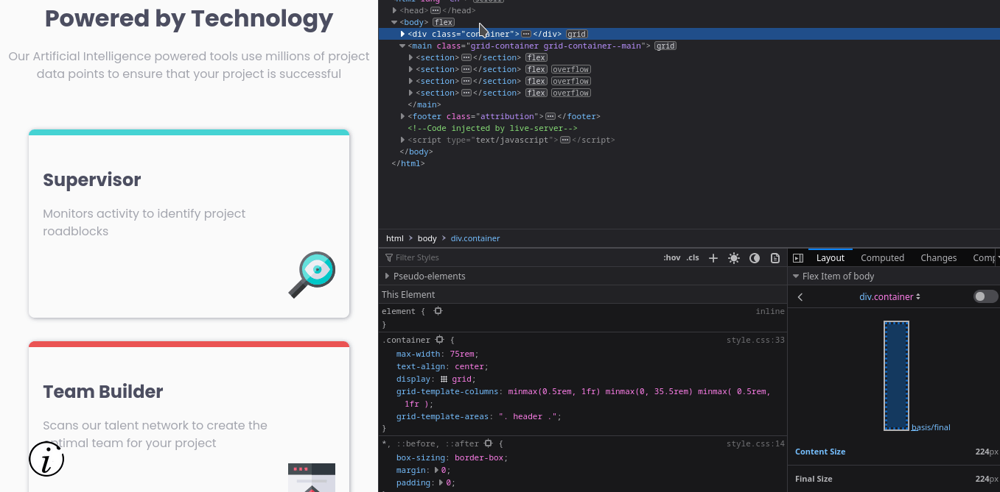

# Frontend Mentor - Four card feature section solution

This is a solution to the [Four card feature section challenge on Frontend Mentor](https://www.frontendmentor.io/challenges/four-card-feature-section-weK1eFYK). Frontend Mentor challenges help you improve your coding skills by building realistic projects.

## Table of contents

- [Overview](#overview)
  - [The challenge](#the-challenge)
  - [Screenshot](#screenshot)
  - [Links](#links)
- [My process](#my-process)
  - [Built with](#built-with)
  - [What I learned](#what-i-learned)
  - [Continued development](#continued-development)
  - [Useful resources](#useful-resources)
- [Author](#author)
- [Acknowledgments](#acknowledgments)

## Overview

in this challenge i used [CSS Grid](https://developer.mozilla.org/en-US/docs/Web/CSS/CSS_Grid_Layout) to practice more about layout and get better in control it;

### The challenge

Users should be able to:

- View the optimal layout for the site depending on their device's screen size

### Screenshot



### Links

- Solution URL: [Add solution URL here](https://your-solution-url.com)
- Live Site URL: [Add live site URL here](https://your-live-site-url.com)

## My process

I stared by structure a semantic html layout, and when i start css i don't want to have a lot of classes and i found it hard to with meaningful names so to solve that I used the old shool OOP css, I don't now if is a good approach but it's solve my problem with names for now anywhere

### Built with

- Semantic HTML5 markup
- CSS custom properties
- Flexbox
- CSS Grid
- Mobile-first workflow

### What I learned

in first look at the design I was thinking that well be easy to solve with [CSS Grid](https://web.dev/learn/css/grid/) and it is for the mobile and tablet version, but when I stared with desktop version I stared to get some difficulties to get it look as close to design as possible, I wasn't abele to solve it using _grid-template-areas_, so I disable it in the desktop version and I used instate _grid-column_ and _grid-row_ like so

```css
@media (min-width: 65.0111rem) {
  .container {
    max-width: 95rem;
    grid-template-columns: minmax(0.5rem, 1fr) minmax(0, 65.5rem) minmax(0.5rem, 1fr);
  }

  .header > p {
    max-width: 50ch;
    margin-inline: auto;
  }
  .grid-container {
    grid-template-columns: minmax(0.5rem, 1fr) repeat(9, 1fr) minmax(0.5rem, 1fr);
    grid-template-areas: none;
  }

  .grid-container > section:nth-child(1) {
    grid-column: 2 / 5;
    grid-row: 2/4;
  }

  .grid-container > section:nth-child(2) {
    grid-column: 5 / 8;
    grid-row: 1 / 3;
  }

  .grid-container > section:nth-child(3) {
    grid-column: 5 / 8;
    grid-row: 3 / 6;
  }
  .grid-container > section:nth-child(4) {
    grid-column: 8 / 11;
    grid-row: 2 / 4;
  }
}
```

```js
const proudOfThisFunc = () => {
  console.log("🎉");
};
```

### Useful resources

- [How to Keep Your CSS Grid Layouts Accessible](https://webdesign.tutsplus.com/articles/a-guide-to-css-grid-and-accessibility--cms-32857) - How to Make Layouts Accessible
- [A Guide on How To Use CSS Grids for Layouts](https://appcode.app/a-guide-on-how-to-use-css-grids-for-layouts/) - Examples of Web Page Layout Using CSS Grid.
- [Expandable Sections Within a CSS Grid](https://css-tricks.com/expandable-sections-within-a-css-grid/)

## Author

- Website - [Imad](https://imadbg01.github.io/)
- Frontend Mentor - [@imadbg01](https://www.frontendmentor.io/profile/imadbg01)
- Twitter - [@ImadBg4](https://twitter.com/ImadBg4)

## Acknowledgments

A big thank you to anyone providing feedback on my solution. It definitely helps to find new ways to code and find easier solutions!
